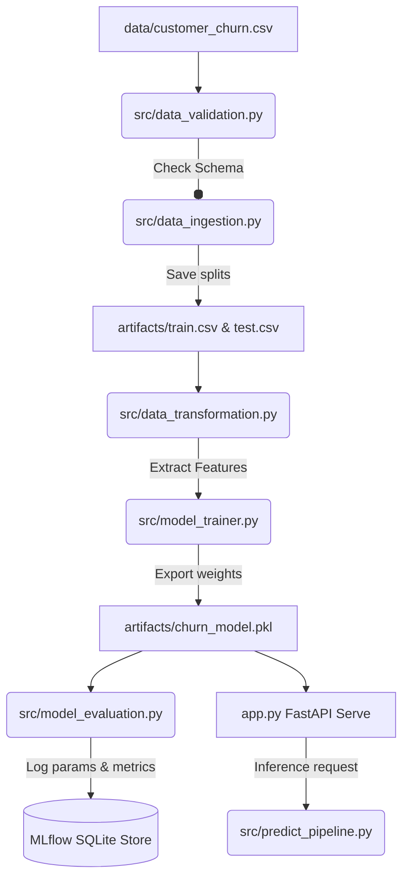

# 🚀 Production-Grade Customer Churn prediction ML Pipeline

[](https://www.python.org/)
[](https://fastapi.tiangolo.com/)
[](https://mlflow.org/)
[](https://www.docker.com/)
[](#cicd-pipeline)

An end-to-end, production-grade machine learning system designed to predict customer churn. The project is built with a decoupled modular architecture, data quality validations, local MLflow tracking, low-latency FastAPI inference serving, containerization, and continuous integration.

---

## 📐 System Architecture

The workflow is decoupled into dedicated, single-responsibility modules coordinated by an orchestrator script:



---

## 📂 Project Structure

```
├── .github/workflows/
│   └── mlops-pipeline.yml       # GitHub Actions CI pipeline configuration
├── data/
│   └── customer_churn.csv       # Raw customer dataset (raw data source)
├── artifacts/
│   ├── train.csv                # Train data split output
│   ├── test.csv                 # Test data split output
│   ├── validation_status.txt    # Data validation execution report
│   └── churn_model.pkl          # Trained Random Forest classifier weights
├── logs/
│   └── running_logs.log         # Complete pipeline execution history
├── mlruns/                      # Registered MLflow runs and artifacts
├── src/
│   ├── __init__.py              # Python package marker
│   ├── utils.py                 # Core file-saving, YAML config loading, and logging helpers
│   ├── data_validation.py       # Data quality validation check against expected schema
│   ├── data_ingestion.py        # Dataset ingestion, train/test splitting, and orchestration main
│   ├── data_transformation.py   # Pipeline target and feature matrix separation
│   ├── model_trainer.py         # Classifier trainer module and saver
│   ├── model_evaluation.py      # Test set performance calculation and MLflow registry
│   └── predict_pipeline.py      # Encapsulated prediction engine wrapper for FastAPI
├── app.py                       # Lightweight production REST API (FastAPI)
├── config.yaml                  # Model hyperparameters, path coordinates, and metadata
├── Dockerfile                   # Deployment containerization blueprint
└── requirements.txt             # Project library requirements
```

---

## 🛠️ Key Features

* **Data Validation Shield**: Checks incoming dataset columns and data types against a strictly defined schema before processing to prevent pipeline crashes.
* **Metadata-Driven Configuration**: Model hyperparameters (like `n_estimators`) and all file paths are fully decoupled into `config.yaml`.
* **Experiment Auditing (MLflow)**: Automatically logs parameters, classification metrics (accuracy, precision, recall, f1), and registers trained models into a SQLite backend store.
* **Low-latency REST Endpoint**: Serves live inferences using FastAPI with Pydantic request body validation.
* **Containerized Deployment**: Ready-to-go Docker configuration for zero-dependency local or cloud hosting.
* **Automated CI Workflow**: Every commit is verified by GitHub Actions, running validation tests, training the pipeline, and confirming Docker builds.

---

## 🚀 Getting Started

### 1. Installation & Environment Setup
Clone the repository and install dependencies in a clean virtual environment:

```bash
# Create virtual environment
python -m venv venv
source venv/Scripts/activate  # Windows
# source venv/bin/activate    # macOS/Linux

# Install requirements
pip install -r requirements.txt
```

### 2. Running the Training & Logging Pipeline
Run the data ingestion script directly. It will perform schema validation, split the dataset, train the RandomForest model, save the pickle binary, and write logs to MLflow:

```bash
python src/data_ingestion.py
```

### 3. Launching the MLflow UI
To audit experiment metrics and register models, start the MLflow server:

```bash
mlflow ui --backend-store-uri sqlite:///mlflow.db --host 127.0.0.1 --port 5000
```
Open **[http://127.0.0.1:5000](http://127.0.0.1:5000)** in your browser.

### 4. Running the API Server Local Host
Run uvicorn to host the FastAPI REST API:

```bash
uvicorn app:app --reload --host 127.0.0.1 --port 8000
```
Open **[http://127.0.0.1:8000/docs](http://127.0.0.1:8000/docs)** to view the interactive OpenAPI documentation.

---

## 🐳 Docker Deployment

To build and run the pipeline inside a reproducible Docker container:

```bash
# Build the image
docker build -t customer-churn-api:latest .

# Run the container
docker run -d -p 8000:8000 --name customer-churn-container customer-churn-api:latest
```

---

## ✉️ API Usage Example

Send a `POST` request to `http://127.0.0.1:8000/predict` with customer features:

### Request body
```json
{
  "credit_score": 608,
  "age": 41,
  "tenure": 1,
  "balance": 83807.86,
  "num_of_products": 1,
  "has_credit_card": 0,
  "is_active_member": 1,
  "estimated_salary": 112542.58
}
```

### Response body
```json
{
  "churn_prediction": 0,
  "status_verdict": "Loyal Customer Risk Low",
  "confidence_score": 0.96
}
```
